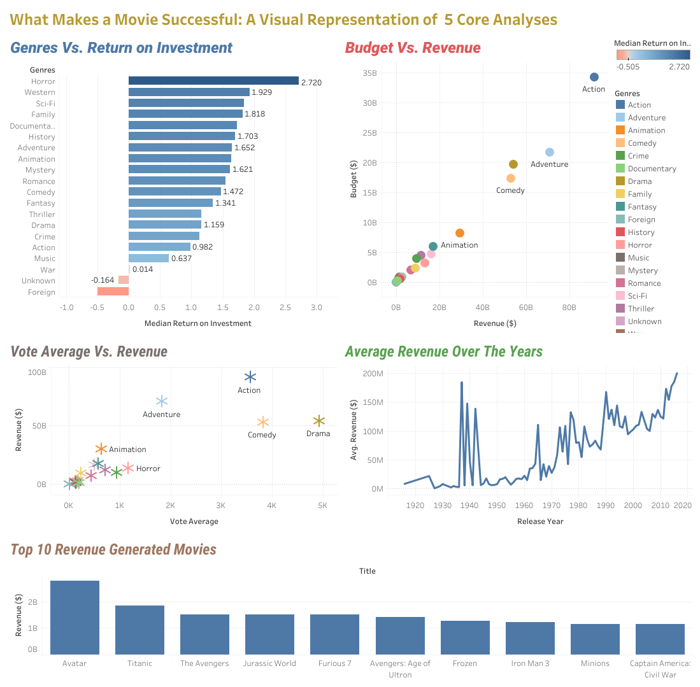
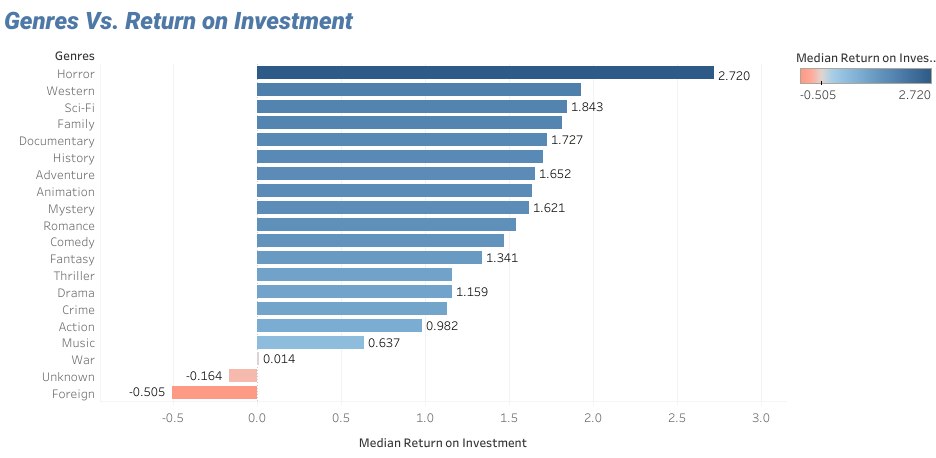
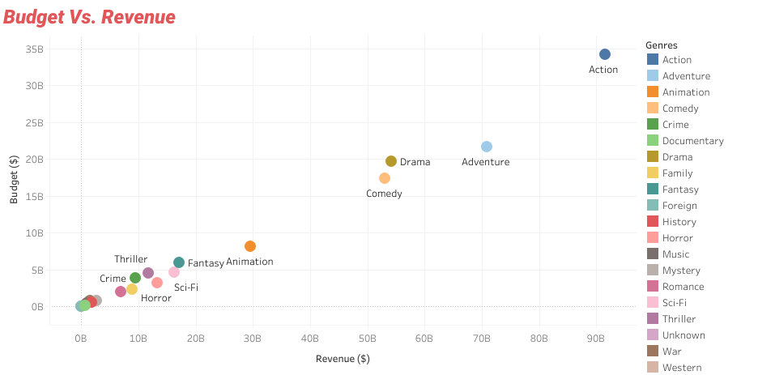
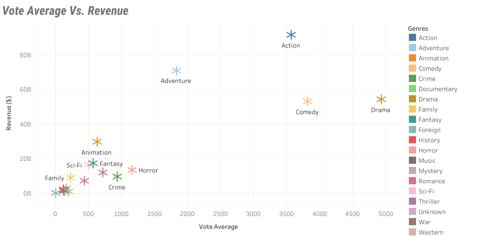
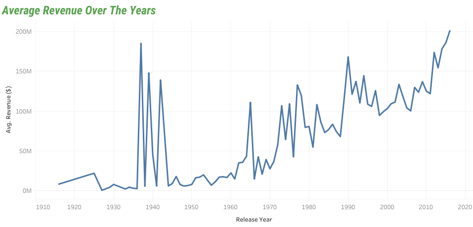
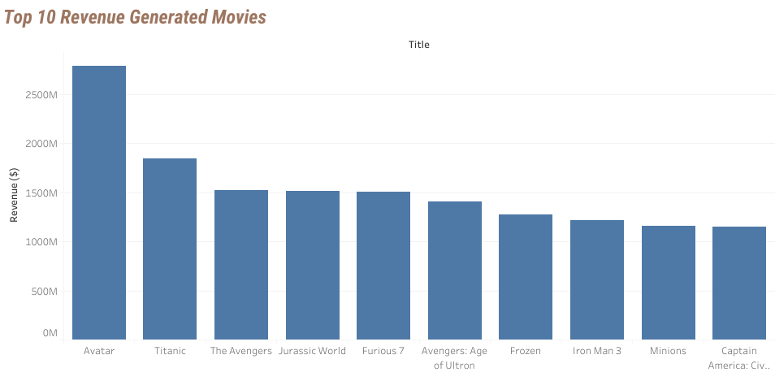

# 🎬 What Makes a Movie Successful?
### An Exploratory Data Analysis Using the TMDB Dataset

[](https://www.python.org/)
[](https://jupyter.org/)
[](https://public.tableau.com/app/profile/akhfash.uddin.deepto/viz/Project_Entertainment/All_at_a_Glance#1)
[](https://pandas.pydata.org/)
[](https://opensource.org/licenses/MIT)

---

## 📌 Project Overview

This project investigates the key drivers of commercial success in the film industry using a curated subset of the **TMDB (The Movie Database) dataset**. Seven analytical perspectives are explored — genre profitability, budget efficiency, audience reception, temporal revenue trends, and production volume distribution — to surface actionable patterns for production strategy and investment decisions.

> **Analyst:** Akhfash Uddin Deepto  
> **Dataset:** TMDB Movies — Refreshed (3,211 records · 9 features)  
> **Time Span:** 1916 – 2016  

---

## 📊 Interactive Dashboard

> For the best visual experience, explore the **full interactive Tableau dashboard**:

### 🔗 [View on Tableau Public →](https://public.tableau.com/app/profile/akhfash.uddin.deepto/viz/Project_Entertainment/All_at_a_Glance#1)



*The dashboard consolidates all 5 core visual analyses into a single interactive view — including genre ROI rankings, budget-revenue correlation, vote-average scatter, revenue trends over time, and the top 10 highest-grossing films.*

---

## 📁 Repository Structure

```
what-makes-a-movie-successful/
│
├── 📓 what_makes_a_movie_successful_modified.ipynb   # Main analysis notebook
├── 📊 tmdb_movie_data.csv                            # Cleaned dataset
├── 🖼️  Dashboard.png                                 # Full dashboard snapshot
├── 🖼️  Genre_Vs_ROI.png                              # Analysis 1 chart
├── 🖼️  Budget_Vs_Revenue.png                         # Analysis 2 chart
├── 🖼️  Vote_Avg_Vs_Revenue.png                       # Analysis 3 chart
├── 🖼️  Average_Revenue_Over_The_Years.png            # Analysis 4 chart
├── 🖼️  Top_10_Revenue_Generated_Movies.png           # Analysis 5 chart
└── 📄 README.md                                      # Project documentation
```

---

## 🗂️ Dataset Description

| Feature | Description |
|---|---|
| `Title` | Film title |
| `Genres` | Primary genre classification |
| `Release Year` | Year of theatrical release |
| `Budget ($)` | Production budget in USD |
| `Revenue ($)` | Global box-office gross in USD |
| `Vote Average` | Audience/critic rating on TMDB (0–10) |
| `Vote Count` | Number of votes submitted |
| `Return on Investment (ROI)` | Computed as Revenue ÷ Budget |
| `Profit ($)` | Revenue minus Budget |

**Pre-cleaning applied:** Duplicate entries, records with missing budget/revenue, and films with a $0 budget were excluded to ensure analytical integrity.

> ⚠️ **ROI Definition:** ROI here = *Revenue ÷ Budget*. An ROI of 2.0 means the film earned twice its production cost. This is **not** net profit after marketing and distribution costs.

---

## 🔬 Analyses & Key Findings

### Analysis 1 — Genre vs. Return on Investment (ROI)



**Horror** is the single most capital-efficient genre with a **median ROI of 2.72×**, meaning the typical Horror film earns nearly three times its production budget. This is driven structurally by low production costs rather than exceptionally high revenues.

| Rank | Genre | Median ROI |
|---|---|---|
| 1 | Horror | 2.720 |
| 2 | Western | ~1.9 |
| 3 | Sci-Fi | 1.843 |
| 4 | Family | ~1.8 |
| 5 | Documentary | 1.727 |
| ... | ... | ... |
| 19 | Unknown | -0.164 |
| 20 | Foreign | -0.505 |

> **Insight:** High-volume genres (Drama, Comedy, Action) do not dominate ROI rankings. Horror achieves outsized efficiency with far smaller budgets. Notably, Foreign and Unknown are the only two genres with a negative median ROI — meaning the typical film in these categories failed to recoup even its production budget.

---

### Analysis 2 — Budget vs. Revenue



A **strong positive correlation (r = 0.70)** exists between production budget and global box-office revenue. Budget accounts for approximately **49% of revenue variance** — significant, but leaving substantial room for other factors.

- **Action** dominates both axes, generating ~$90B in total revenue with the highest total budget spend (~$35B).
- **Adventure** and **Drama** follow as the next largest clusters by revenue (~$70B and ~$55B respectively).
- **Animation** delivers strong revenue (~$30B) relative to a moderate budget footprint.
- Most genres cluster tightly near the origin — a long-tail distribution where a few genres command the vast majority of industry capital.

> **Insight:** Budget scale matters, but is not destiny. The $20M–$100M range represents an optimal risk-reward band for balanced portfolio performance.

---

### Analysis 3 — Vote Average vs. Revenue



Audience and critic ratings show a **very weak correlation with revenue (r = 0.19)**, effectively disconfirming the assumption that quality drives commercial performance.

- **Action** leads total revenue (~$90B) at a mid-range vote count (~3,800).
- **Drama** achieves the highest vote count (~5,000) but far lower revenue than Action.
- **Adventure** and **Comedy** sit in the mid-revenue, mid-vote range.
- Most genres cluster near the bottom-left — modest vote counts and modest revenues.

> **Insight:** Marketing reach, franchise equity, release timing, and genre selection are more reliable revenue levers than audience ratings. A critically beloved film is not automatically a box-office success.

---

### Analysis 4 — Average Revenue Over the Years



Revenue has grown substantially since the **1990s**, reflecting the globalization of theatrical markets and the rise of franchise filmmaking. The modern era (post-2000) operates in a structurally higher-ceiling revenue environment, with average per-film revenue approaching **$200M** by 2016.

Key observations:
- **Late 1930s spikes** (peaking ~$185M avg.) correspond to a handful of landmark productions — like *Gone with the Wind* — dominating a very low-volume market.
- **1945–1960:** A prolonged low-revenue plateau as the industry adapted post-WWII.
- **1960s–1980s:** Gradual upward trend, punctuated by early blockbuster-era peaks.
- **Post-1990:** Sustained structural growth, with the modern market ceiling rising every decade.

> **Insight:** Historical revenue comparisons must be made carefully — not just for inflation, but for structural market size. A 1970s blockbuster and a 2010s blockbuster operate in fundamentally different commercial environments.

---

### Analysis 5 — Top 10 Revenue-Generating Films



| Rank | Title | Revenue |
|---|---|---|
| 1 | Avatar | ~$2,750M |
| 2 | Titanic | ~$1,850M |
| 3 | The Avengers | ~$1,520M |
| 4 | Jurassic World | ~$1,515M |
| 5 | Furious 7 | ~$1,510M |
| 6 | Avengers: Age of Ultron | ~$1,405M |
| 7 | Frozen | ~$1,290M |
| 8 | Iron Man 3 | ~$1,250M |
| 9 | Minions | ~$1,165M |
| 10 | Captain America: Civil War | ~$1,155M |

All top-grossing films are **high-budget franchise or event productions**. Avatar alone (~$2.75B) outpaces 2nd-place Titanic (~$1.85B) by nearly $900M — a remarkable gap that underscores how dominant outlier productions can be.

> **Insight:** Commercial dominance at this scale requires massive franchise equity, global marketing, and production budgets in the $74M–$280M range. There is no low-budget path to this tier.

---

### Analysis 6 — Top Films by ROI

The highest ROI films are **micro-budget Horror and Documentary productions** — often with budgets under $100K that generated millions in revenue. This is the precise inverse of the top-revenue list.

> **Insight:** Commercial dominance and capital efficiency are two entirely distinct success modes. The strategies that maximize absolute revenue are incompatible with those that maximize ROI.

---

### Analysis 7 — Movie Count by Genre (Production Volume)

**Drama** (741 films), **Comedy** (630), and **Action** (588) collectively account for over **50% of all productions** in the dataset.

| Genre | Film Count | Median ROI Rank |
|---|---|---|
| Drama | 741 | Mid-tier |
| Comedy | 630 | Lower-mid |
| Action | 588 | Lower-mid |
| Horror | 196 | **1st** |
| Documentary | 29 | Top 5 |

> **Insight:** Horror — the most ROI-efficient genre — is produced at less than **27% the volume of Drama**, representing a systematic market underexploitation. Documentary (29 films) similarly punches well above its weight in ROI despite minimal production volume. Production volume reflects historical industry habit more than financial optimization.

---

## 📋 Summary of All Findings

| Analysis | Key Finding |
|---|---|
| Genre vs. ROI | Horror is the most capital-efficient genre; median ROI ≈ 2.72× |
| Budget vs. Revenue | Strong positive correlation (r = 0.70); budget explains ~49% of revenue variance |
| Vote Average vs. Revenue | Very weak correlation (r = 0.19); quality does not reliably predict box office |
| Revenue Over Time | Revenue has grown substantially since the 1990s; modern films operate in a higher-ceiling market |
| Top by Revenue | All top-grossing films are high-budget franchise/event productions ($74M–$280M budgets) |
| Top by ROI | Highest ROI films are micro-budget Horror/Documentary productions (budgets under $100K) |
| Genre Distribution | Drama, Comedy, and Action dominate production volume but not ROI efficiency |

---

## 💡 Strategic Implications

1. **For investors seeking capital efficiency:** Micro-budget Horror and Documentary films offer the highest risk-adjusted returns, evidenced by both median ROI rankings and extreme ROI outliers.

2. **For studios targeting absolute revenue:** High-budget franchise productions in Action, Adventure, and Animation remain the reliable path to box-office leadership.

3. **On budget allocation:** A 0.70 correlation between budget and revenue confirms investment scale matters — but diminishing returns and high-budget failures suggest the optimal range lies around **$20M–$100M** for balanced risk/reward.

4. **On quality vs. commercial success:** Audience ratings are a poor standalone predictor of revenue. Marketing, timing, franchise equity, and genre selection are far more actionable levers.

---

## 🛠️ Tech Stack

| Tool | Purpose |
|---|---|
| Python 3.13 | Core programming language |
| Pandas | Data manipulation and aggregation |
| NumPy | Numerical operations |
| Matplotlib | Static chart generation |
| Seaborn | Statistical visualization |
| Jupyter Notebook | Interactive analysis environment |
| Tableau Public | Interactive dashboard and presentation |

---

## ▶️ How to Run This Project Locally

### Prerequisites
- Python 3.8 or higher
- pip or conda package manager

### Steps

**1. Clone the repository**
```bash
git clone https://github.com/YOUR_USERNAME/what-makes-a-movie-successful.git
cd what-makes-a-movie-successful
```

**2. Install required libraries**
```bash
pip install pandas numpy matplotlib seaborn jupyter
```

**3. Launch Jupyter Notebook**
```bash
jupyter notebook
```

**4. Open the notebook**  
In the Jupyter interface that opens in your browser, click on `what_makes_a_movie_successful_modified.ipynb` and run all cells.

---

## 📜 License

This project is licensed under the [MIT License](https://opensource.org/licenses/MIT). You are free to use, modify, and distribute this project with attribution.

---

## 🙋 About the Analyst

**Akhfash Uddin Deepto**  
Aspiring Data Analyst | TMDB Movie Analytics  

📊 [Tableau Portfolio](https://public.tableau.com/app/profile/akhfash.uddin.deepto/viz/Project_Entertainment/All_at_a_Glance#1)

---

*All monetary figures are nominal USD (not inflation-adjusted). Analysis conducted on the TMDB Movies — Refreshed dataset.*
